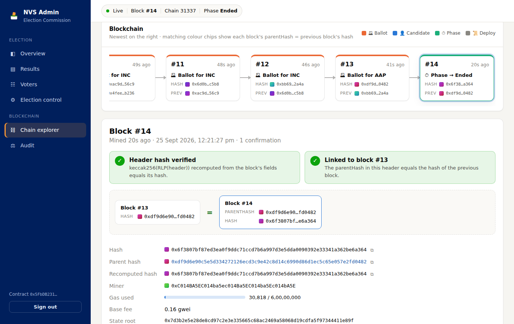
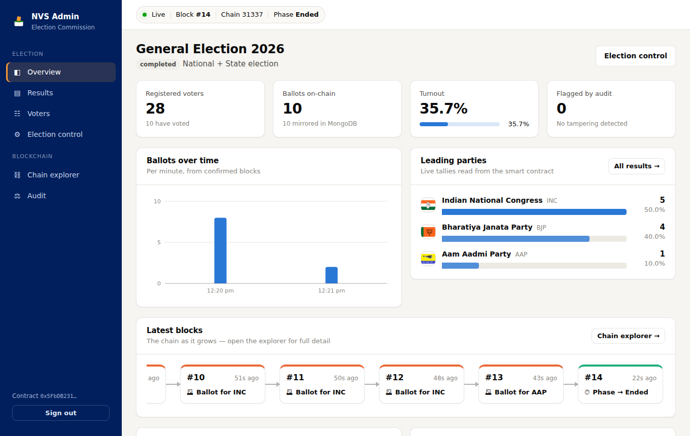
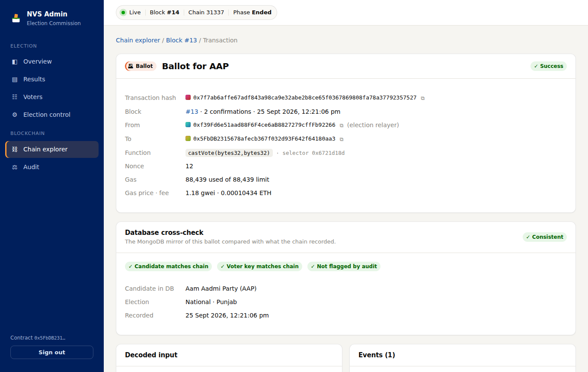

# 🗳️ National Voting System — MERN + Hardhat

A blockchain-secured voting system built on **MongoDB, Express, React and Node** with an
**Ethereum smart contract (Hardhat)** as the tamper-evident ballot box, and an admin
dashboard with a **live blockchain explorer** that visualises every block, transaction
and contract event.



## What it does

**Voters**
- Sign in with Aadhaar + Voter ID + mobile number and confirm with an SMS OTP. Aadhaar and
  Voter ID are only ever stored as a SHA-256 hash.
- See the ballot for their state (national and/or state election) and cast one vote.
- Every ballot is an Ethereum transaction. The voter gets a receipt (tx hash, block number)
  that anyone can check at `/verify` without revealing the choice.
- Results are public once the election is closed, read straight from the contract.

**Administrators**
- **Overview**: registered voters, ballots on-chain vs in MongoDB, turnout, a ballots-over-time
  chart, leading parties, recent ballots, turnout by state and a strip of the latest blocks.
- **Chain explorer** — the blockchain visualiser:
  - a live, horizontally scrolling chain of blocks, colour-coded by what they contain (ballot,
    candidate registration, phase change, deployment). Each block shows its hash and its
    parent's hash, and matching colour chips make the hash links visible.
  - new blocks stream in over Server-Sent Events as they are mined.
  - block detail: the header, the **header hash recomputed** from its RLP encoding
    (keccak256), the **parent-hash link check**, and every transaction decoded against the
    contract ABI (function, arguments, emitted events, gas).
  - transaction pages with decoded input and events, raw signature and calldata, and a
    **database cross-check** that compares the MongoDB mirror with what the chain recorded.
  - a contract event feed, plus a **chain integrity check** that re-hashes up to 1,000 blocks
    and confirms the contract's tallies agree with its `VoteCast` events.
- **Audit**: cross-checks every MongoDB ballot against the chain. It flags votes injected
  straight into the database, altered candidates or voters, records deleted from the
  database, and profiles that are out of sync. It then compares per-party tallies.
- **Election control**: move the election through Preparation → Active → Completed (mirrored
  on-chain as Registration → Voting → Ended; Ended is irreversible), enable national/state
  ballots, register parties and switch them on or off. Every change is a transaction.
- **Results** and **Voters** pages (identity data is masked).

| Overview | Transaction + DB cross-check |
| --- | --- |
|  |  |

## Architecture

```
┌──────────────┐   /api (Vite proxy)   ┌──────────────────┐   ethers v6    ┌───────────────────┐
│ React (Vite) │ ────────────────────▶ │ Express API      │ ─────────────▶ │ Hardhat node      │
│ frontend/    │ ◀── SSE block feed ── │ backend/         │ ◀── blocks ─── │ Voting.sol        │
└──────────────┘                       │  • auth + OTP    │                └───────────────────┘
                                       │  • relayer wallet│   mongoose     ┌───────────────────┐
                                       │  • explorer/audit│ ─────────────▶ │ MongoDB           │
                                       └──────────────────┘                └───────────────────┘
```

- **The chain is written first.** A vote counts only once its transaction is mined; MongoDB
  then stores a mirror record (tx hash, block) for fast queries. The audit keeps the two honest.
- **The backend is the relayer.** Voters never need a wallet. The API signs transactions
  with the wallet that owns the contract, and only the owner can submit ballots.
- **Voters are anonymous on-chain.** The contract only sees `voterKey = HMAC(VOTER_KEY_SECRET,
  voterIdHash)`. That is enough to enforce one vote per voter on-chain, but it cannot be traced
  back to a voter without the server secret.

### Smart contract (`blockchain/contracts/Voting.sol`)

| Feature | Details |
| --- | --- |
| Candidate registry | `addCandidate(s)`, keyed by `keccak256(name)`; `setCandidateActive` |
| Phases | `Registration` ⇄ `Voting` → `Ended` (terminal: results are frozen) |
| Ballots | `castVote(voterKey, candidateId)`, owner only; reverts `AlreadyVoted` for a repeat voter |
| Views | `getAllCandidates()`, `getCandidate()`, `totalVotes`, `hasVoted(voterKey)` |
| Events | `ElectionCreated`, `CandidateAdded`, `CandidateStatusChanged`, `PhaseChanged`, `VoteCast` |
| Errors | Custom errors (`WrongPhase`, `UnknownCandidate`, `CandidateInactive`, …), decoded into friendly API messages |

## Project structure

```
├── package.json            # npm workspaces + `npm run dev` orchestration
├── blockchain/             # Hardhat project
│   ├── contracts/Voting.sol
│   ├── scripts/deploy.js   # deploys and writes backend/blockchain/deployment.json + ABI
│   └── test/Voting.test.js # 21 contract tests
├── backend/                # Express + MongoDB API
│   ├── config/             # env configuration (see .env.example)
│   ├── blockchain/abi/     # contract ABI (deployment.json is generated, git-ignored)
│   ├── controllers/  routes/  middleware/  models/
│   ├── services/
│   │   ├── chain.js        # provider, relayer wallet, contract calls, DB↔chain sync
│   │   ├── explorer.js     # blocks, decoded txs/events, header re-hash, SSE feed
│   │   ├── audit.js        # database ↔ blockchain audit
│   │   └── sms.js          # Renflair SMS OTP (console fallback in development)
│   ├── seeds/seedParties.js
│   ├── scripts/reset-votes.js
│   └── tests/              # API + unit tests (node:test)
└── frontend/               # React 19 + React Router 7 + Vite
    ├── public/parties/     # party flags
    └── src/
        ├── pages/voter/    # sign in, ballot, receipt verification, public results
        ├── pages/admin/    # overview, results, voters, election, explorer, block, tx, audit
        └── components/     # chain visualiser, charts, UI kit
```

## Getting started

### Prerequisites
- Node.js 18+ (20 or 22 recommended)
- MongoDB running locally (`mongodb://127.0.0.1:27017`) or a MongoDB Atlas URI

### 1. Install

```bash
npm install                 # installs all three workspaces
cp backend/.env.example backend/.env   # optional in development, required in production
```

### 2. Seed the parties

```bash
npm run seed
```

### 3. Run everything

```bash
npm run dev
```

This starts, in one terminal:
1. a Hardhat node on `http://127.0.0.1:8545`
2. the contract deployment (`backend/blockchain/deployment.json` is written)
3. the API on `http://localhost:5000`, which registers the parties on-chain and opens voting
4. the React app on **http://localhost:5173**

| URL | What |
| --- | --- |
| http://localhost:5173 | Voter sign-in and ballot |
| http://localhost:5173/verify | Public receipt verification |
| http://localhost:5173/admin/login | Admin dashboard (default admin mobile: `9694671392`, set `ADMIN_PHONES`) |

Without `RENFLAIR_API_KEY`, OTPs are printed in the API log and shown in the UI (development
only), so you can try the whole flow without an SMS gateway.

You can also run the pieces separately: `npm run chain`, `npm run deploy`, `npm run server`
and `npm run client`.

> **Restarted the Hardhat node?** A fresh chain has no votes. Run `npm run reset-votes` to clear
> the database mirror, then redeploy (`npm run deploy`). The API picks up the new deployment
> automatically.

### Tests

```bash
npm test          # contract tests (Hardhat) + backend tests
```

### Production

```bash
npm run build     # builds frontend/dist
npm start         # Express serves the API and the built React app on PORT
```

Set `NODE_ENV=production`, `JWT_SECRET`, `VOTER_KEY_SECRET`, `MONGODB_URI`, `RPC_URL`,
`RELAYER_PRIVATE_KEY` and `RENFLAIR_API_KEY`. To deploy to Sepolia, set `SEPOLIA_RPC_URL`
and `DEPLOYER_PRIVATE_KEY` in `blockchain/.env` and run `npm run deploy:sepolia -w blockchain`.

## API overview

| Method | Endpoint | Auth | Purpose |
| --- | --- | --- | --- |
| POST | `/api/auth/authenticate` | – | Register / sign in a voter, send OTP |
| POST | `/api/auth/verify-otp` · `/resend-otp` | – | Verify / resend voter OTP |
| POST | `/api/auth/admin-login` · `/admin-verify-otp` | – | Admin OTP sign-in |
| GET | `/api/elections/settings` | – | Election status |
| GET | `/api/elections/candidates?type=national\|state` | voter | Ballot for the voter's state |
| GET | `/api/elections/results` | – | Final results (after the election closes) |
| GET | `/api/voting/status` | voter | Has voted? + receipt |
| POST | `/api/voting/vote` | voter | Cast a ballot (on-chain first) |
| GET | `/api/voting/receipt/:txHash` | – | Public proof of inclusion |
| GET | `/api/admin/stats` · `/results` · `/voters` | admin | Dashboard data |
| GET/PUT | `/api/admin/election` | admin | Election settings / phase (on-chain) |
| GET/POST/PATCH | `/api/admin/parties` | admin | Party registry (on-chain) |
| GET/POST | `/api/admin/audit` | admin | Latest audit / run audit |
| POST | `/api/admin/chain/sync` | admin | Reconcile contract with database |
| GET | `/api/admin/chain/overview` · `/blocks` · `/blocks/:id` · `/tx/:hash` · `/events` · `/integrity` | admin | Explorer |
| GET | `/api/admin/chain/stream?token=` | admin | Live block feed (SSE) |
| GET | `/api/health` | – | Database + chain status |

## Security notes

- OTPs are 6 digits from a CSPRNG, stored only as an HMAC, valid for 10 minutes, limited to 5
  attempts, with a 30 s resend cooldown. Auth endpoints are rate-limited.
- A voter's mobile number is bound at registration, so knowing someone's Aadhaar and Voter ID
  is not enough to redirect their OTP.
- Double voting is blocked three ways: the MongoDB `hasVoted` flag with a short vote lock, a
  unique index on the voter hash, and the contract's `hasVoted[voterKey]`.
- All secrets come from the environment. The API refuses to start in production without
  `JWT_SECRET` / `VOTER_KEY_SECRET`, and will not use the Hardhat dev key against a non-local RPC.
- The live stream takes the admin token as a query parameter, because `EventSource` cannot send
  headers. Serve the app over HTTPS in production.

## License

MIT
